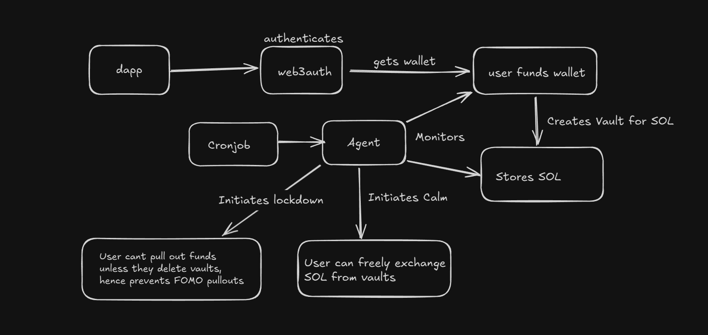
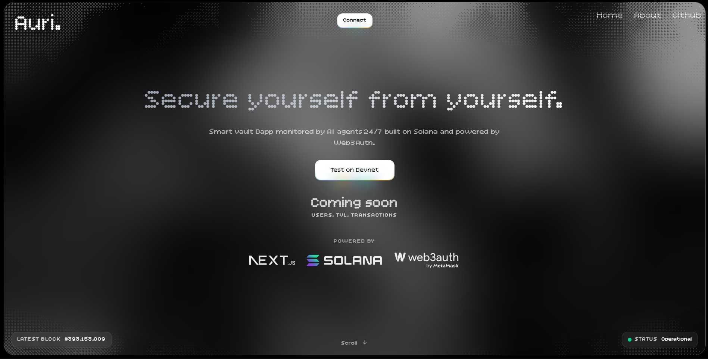
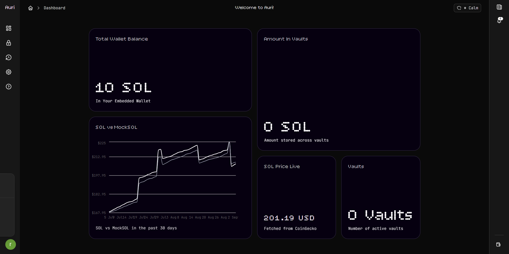
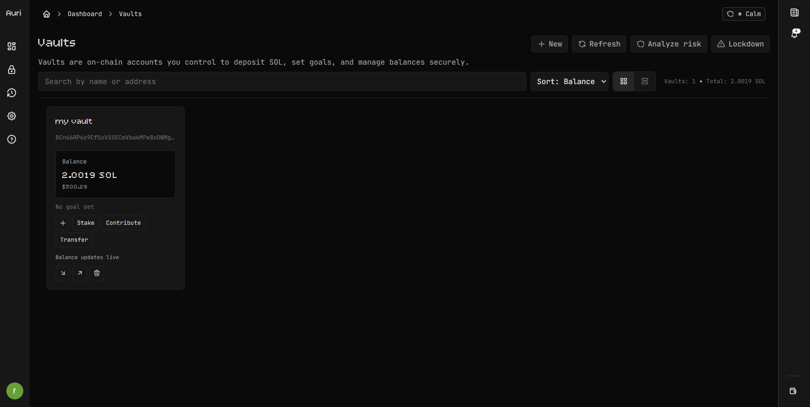
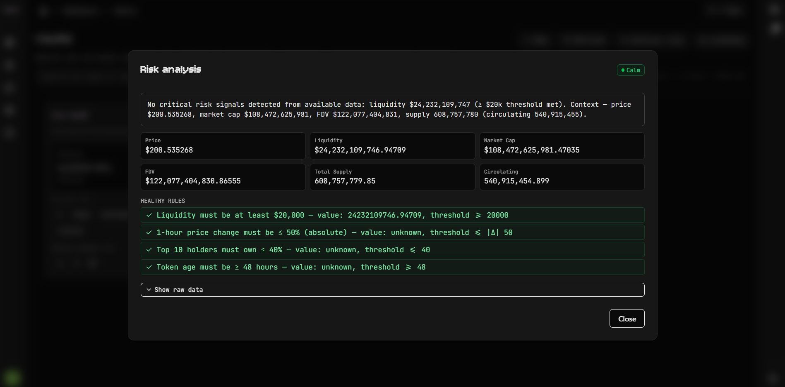
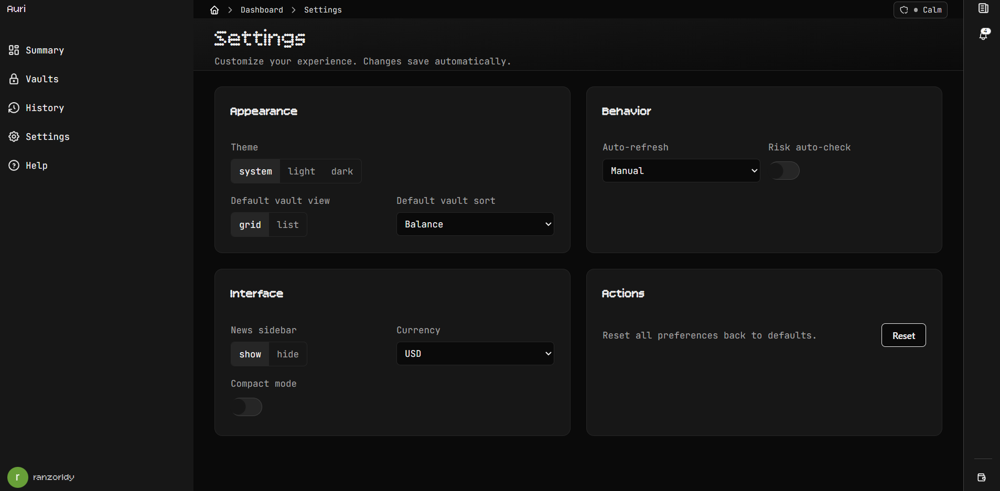

## Auri — Smart Vaults on Solana (Next.js 15, React 19)

<!-- Banner Placeholder: replace ./public/banner.png with your banner asset -->


<!-- GitHub Stats Badges -->
[](https://github.com/ranzorldy/Auri)
[](https://github.com/ranzorldy/Auri/fork)
[](https://github.com/ranzorldy/Auri/issues)
[](https://github.com/ranzorldy/Auri/pulls)
[](https://github.com/ranzorldy/Auri/commits)
[](LICENSE)
[](https://github.com/ranzorldy/Auri/graphs/contributors)
[](https://github.com/ranzorldy/Auri)
[](https://github.com/ranzorldy/Auri)

Auri is a dApp built on solana that helps users avoid market FOMO buys by surfacing token risk signals for the tokens they hold in their wallets. It achieves the above by letting users create smart vaults which would hold their Solana and based on market volatality and other factors they would be locked down by our AI agents.

### Highlights of Our Project
- Wallet Integration auth via Web3Auth (Use whatever you like for sigining up)
- Create Vaults and Store your valueable SOL for safekeeping by AI agents
- Users can also utilize Solana Pay to accept contributions from other users using Metamask/Phantom
- Transfer Ownership of your Vaults to your trusted ones
- Set Personal Goals for each vault you create
- Get Proper Analysis of your Tokens and states by our AI agents.
- Stake your SOL directly from your vaults and yield gains. (Feature Comming Soon)

---

## Tech Stack
- Next.js 15 + React 19
- TypeScript, Tailwind CSS 4
- Web3Auth , @solana/web3.js
- Data fetching/caching: @tanstack/react-query
- Animations: motion, gsap, lenis
- Charts: recharts

---

## Project Structure
```
app/
  layout.tsx              # Root providers: Web3Auth, ChainInitializer, SolanaAuth, Toaster
  page.tsx              
  api/
    market/sol-msol/route.ts     # Staking handler route 
    risk/analyze/route.ts        # AI agent risk analysis route (BirdEye + Gemini)
    pay/contribute/route.ts      # Solana Pay tx builder for vault contributions
  dashboard/
    layout.tsx            # Dashboard shell: Sidebar, Breadcrumbs, News, Loader
    page.tsx              # Home; plus /history, /help, /settings, /vaults, /vaults/create
components/               # UI (charts, modals, sidebar, toasts, loaders, etc.)
providers/                # Web3Auth, SolanaAuth, React Query, Chain init, Lenis
lib/                      # constants (PROGRAM_ID), utils (cn)
idl/                      # Program IDL placeholder
```

---

## Features
- Landing page with parallax-style sections (Hero, Mission, Features, HowItWorks, FAQ)
- Dashboard shell with sidebar and news panel
- Vault modals: `VaultCreateModal`, `VaultContributeModal`, `VaultTransferModal`, `VaultGoalModal`, `VaultDeleteModal`, `VaultAmountModal`
- Risk components: `RiskDetailsModal`, `LockdownNoticeModal`
- Charts: `Chart`, `AreaChart` with `recharts`
- Toast notifications and page loader

---

## Environment Variables
Create `.env.local` in the repo root. Fill as needed (optional keys are marked).

```bash
# Solana RPCs
NEXT_PUBLIC_SOLANA_RPC_URL=https://api.devnet.solana.com             # optional; client-side in SolanaAuthProvider
SOLANA_RPC_ENDPOINT=https://api.devnet.solana.com                    # used by /api/pay/contribute
SOLANA_RPC_MAINNET=https://api.mainnet-beta.solana.com               # used by /api/risk/analyze when chain fetch is enabled

# BirdEye (strongly recommended to avoid 429)
BIRDEYE_API_KEY=your_birdeye_key

# Risk engine model key (optional: enables Gemini analysis path)
GEMINI_API_KEY=your_gemini_key                                       # or GOOGLE_GEMINI_API_KEY

# Risk engine behavior
RISK_CHAIN_FETCH=0                                                    # set to 1 to fetch wallet SPL holdings on-chain

# Market API override
MSOL_MINT=mSoLzYCxHdYgdzU16g5QSh3i5K3z3KZK7ytfqcJm7So

# Web3Auth (client id currently in code; you can move it to env if desired)
NEXT_PUBLIC_WEB3AUTH_CLIENT_ID=your_web3auth_client_id
```

Notes:

- `/api/risk/analyze` uses only BirdEye market data by default. Set `GEMINI_API_KEY` to enable Gemini JSON reasoning.

---

## Getting Started
```bash
npm install
npm run dev
# open http://localhost:3000
```

- Landing is at `/`.
- Dashboard lives under `/dashboard`.
- Use the sidebar’s Connect action (Web3Auth) to authenticate a wallet session.

Build and start:
```bash
npm run build
npm start
```

---

## Architecture Diagrams



---

## On-chain References

- Program ID: `HDmSK6yiv5CxNwNBMjYGGN1mU6RzpNWvyodzW3VydnQN`
- Latest devnet blockhash: `6P9Y6xwKFxFA7eJGssYsaEhAGR787ueMjuXUE7JKEnc8`
- Explorer: [Transaction on devnet](https://explorer.solana.com/tx/57d3o8GoL2GDcar7nScUzjd7Qp5i2DwSJPNnC27cpW61smccxR8wRHsxeNwh8SsnYnb9wq1zwe13da3V3htLCDN?cluster=devnet)

---

## Architecture & Providers
- `app/layout.tsx`
  - SSR extracts Web3Auth state via `cookieToWeb3AuthState`.
  - Wraps the app with `Web3AuthProvider` + `QueryClientProvider` + `SolanaAuthProvider`.
  - Provides a global `Toaster`.

- `providers/SolanaAuthProvider.tsx`
  - Bridges `@web3auth/modal/react` Solana wallet into a simple React context: `{ address, balanceSOL, login, logout, refresh, accounts, connection, userInfo }`.
  - Persists `userInfo` and `address` in `localStorage` for fast hydration.
  - Uses `NEXT_PUBLIC_SOLANA_RPC_URL` (default: devnet) for balance reads.

- `providers/Web3AuthProvider.tsx`
  - Configures Web3Auth (SAPPHIRE_DEVNET) and React Query client.

- `providers/ChainInitializer.tsx`
  - Stub to switch chain if desired; no forced switch by default.

---

## API Reference


### 1. Risk Analysis — POST `/api/risk/analyze`
Analyzes one or more SPL token mints for risk signals. Uses BirdEye market data and a simple local ruleset; optionally invokes Gemini for JSON reasoning.

Body:
```json
{
  "walletAddress": "optional_solana_pubkey",
  "mints": ["optional_mint1", "optional_mint2"]
}
```

Behavior:
- If `RISK_CHAIN_FETCH=1` and `walletAddress` is set, it will fetch detected SPL token mints from chain (mainnet RPC) and analyze up to 25 tokens.
- If no tokens are found, analyses SOL as a fallback (`So1111...`).

Example:
```bash
curl -X POST http://localhost:3000/api/risk/analyze \
  -H "Content-Type: application/json" \
  -d '{
    "walletAddress": "YOUR_WALLET_ADDRESS",
    "mints": []
  }'
```

Response (abridged):
```json
{
  "walletAddress": "...",
  "results": [
    {
      "mint": "...",
      "metrics": { "liquidityUsd": 12345, "priceChange1hPercent": 12.3, ... },
      "rules": [ { "id": "liquidity", "ok": true, ... } ],
      "gemini": { "risk": "LOW_RISK", "justification": "...", ... },
      "birdseye": { "price": 0.01, "liquidity": 12345, ... }
    }
  ],
  "lock": false,
  "state": "Calm",
  "debug": { "total": 1, "model": "gemini-2.5-flash" }
}
```

Env used: `BIRDEYE_API_KEY`, `GEMINI_API_KEY` or `GOOGLE_GEMINI_API_KEY` (optional), `SOLANA_RPC_MAINNET`, `RISK_CHAIN_FETCH`

---

### 3) Vault Contribution Tx — `/api/pay/contribute`
Implements a Solana transaction builder compatible with wallet flows (GET handshake + POST transaction). Defaults to Devnet.

GET handshake (label/icon):
```bash
curl "http://localhost:3000/api/pay/contribute?name=MyVault&vault=VaultPubkey&amount=0.1"
```

POST build transaction:
```bash
curl -X POST "http://localhost:3000/api/pay/contribute?name=MyVault&vault=VaultPubkey&amount=0.1" \
  -H "Content-Type: application/json" \
  -d '{"account":"ContributorPubkey"}'
```

Response (abridged):
```json
{
  "transaction": "base64_serialized_tx",
  "message": "Contribute 0.1 SOL to MyVault"
}
```

Under the hood:
- Encodes an instruction for `PROGRAM_ID` from `lib/constants.ts` using Anchor discriminator `global:contribute` and arguments `(name: string, amount: u64)`.
- Sets `feePayer = contributor` and fills recent blockhash.

Env used: `SOLANA_RPC_ENDPOINT`

---

## UI Notes
- Landing animations are powered by `motion` with smooth scroll via `LenisProvider`.
- Dashboard shows `Breadcrumbs`, `NewsSidebar`, and a `PageLoader` until wallet address is ready.
- Charting uses `recharts`; market data series is consumed from `/api/market/sol-msol`.

---

## Project Images









---

## Scripts
```json
{
  "dev": "next dev --turbopack",
  "build": "next build",
  "start": "next start",
  "lint": "next lint"
}
```

---

## Deployment
- Works well on Vercel. Ensure all required env vars are configured in the dashboard.
- `/api/pay/contribute` exports `runtime = "nodejs"`; keep Node runtime enabled in your platform.
- Provide BirdEye and (optionally) Gemini keys to reduce rate limits and enable model-based justifications.

---

## Troubleshooting
- BirdEye 429 / empty data:
  - Set `BIRDEYE_API_KEY` and retry; the APIs implement basic caching and throttling.
- Wallet not connecting:
  - Confirm Web3Auth client id configuration and allow pop-ups.
  - Ensure you’re on Devnet unless you changed RPCs.
- Risk analysis returns limited fields:
  - Only available fields are used. Set `RISK_CHAIN_FETCH=1` and `SOLANA_RPC_MAINNET` to enrich input from on-chain.

---

## Contributing
PRs welcome. Please keep code clear, typed, and consistent with existing patterns.

## License
Proprietary or to be defined by the repository owner.

